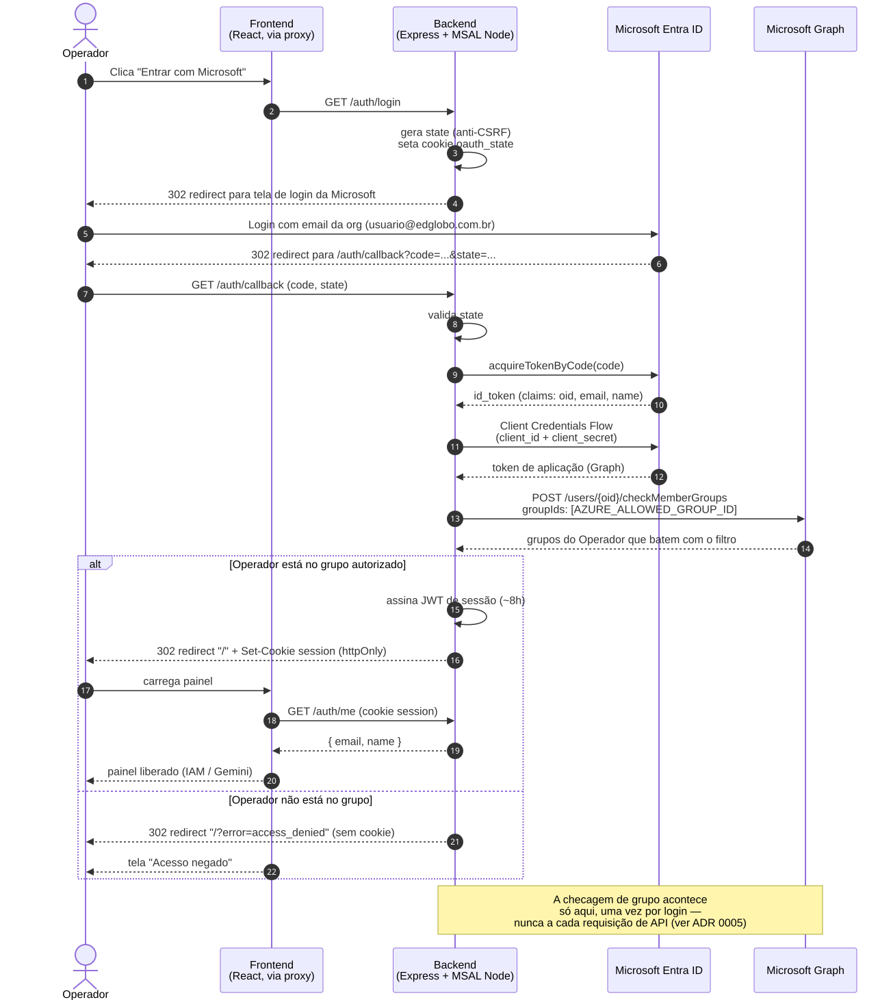

# EdGlobo GCP Admin

Painel web para gerenciar acessos no Google Cloud — quem pode usar o Agentspace e quem tem licença Gemini Enterprise — sem precisar abrir o console do GCP.

---

## Quick Start

```bash
# 1. Instale as dependências
npm run install:all

# 2. Configure as credenciais
cp backend/.env.example backend/.env
# Coloque o arquivo JSON da service account em backend/credentials.json
# Edite backend/.env se necessário

# 3. Rode tudo
npm run dev
```

Abra `http://localhost:5173` no navegador.

> Prefere rodar em containers? Veja a seção [Docker](#docker) abaixo.

---

## Pré-requisitos

### Service Account no GCP

Crie uma service account no projeto `agentspace-469418` com as seguintes roles:

| Role | Para quê |
|------|----------|
| `roles/discoveryengine.agentspaceAdmin` | Gerenciar licenças Gemini Enterprise |
| `roles/iam.securityAdmin` | Gerenciar a role `discoveryengine.user` no IAM |
| `roles/iam.roleAdmin` | Auto-provisionar a custom role `iamValidationProbe`, usada para validar o principal antes de conceder acesso (ver [ADR 0002](docs/adr/0002-validacao-de-principal-via-probe-descartavel.md)) |
| `roles/bigquery.jobUser` | Executar consultas BigQuery para a página de Custos |
| `roles/bigquery.dataViewer` | Ler a tabela de exportação de faturamento — **concessão no dataset `billing_standard` do projeto `infra-bi-355620`** (projeto diferente do que hospeda a SA), via IAM do dataset (não `gcloud projects add-iam-policy-binding`) |

Baixe a chave JSON e salve em `backend/credentials.json`.

> **Por que duas roles separadas?** IAM policy do projeto (`setIamPolicy`) e a Discovery Engine API são sistemas distintos no GCP — cada um exige sua própria permissão.

> **Como a SA consegue rodar a query do BigQuery, se a tabela fica em outro projeto?** São duas concessões, em dois lugares diferentes, e as duas são necessárias — falta uma e a query falha:
>
> 1. **`roles/bigquery.jobUser` no projeto `agentspace-469418`** (onde a SA já vive) — dá permissão pra *rodar e pagar* pelo job de query. Concedida do jeito normal:
>    ```bash
>    gcloud projects add-iam-policy-binding agentspace-469418 \
>      --member="serviceAccount:SEU_SA@agentspace-469418.iam.gserviceaccount.com" \
>      --role="roles/bigquery.jobUser"
>    ```
> 2. **`roles/bigquery.dataViewer`, mas só no dataset `billing_standard`, dentro do projeto `infra-bi-355620`** — dá permissão pra *ler* a tabela do export. Como é um recurso de outro projeto, `gcloud projects add-iam-policy-binding` não serve aqui (só afeta o projeto que você aponta, não concede nada em outro). Quem tem acesso a `infra-bi-355620` precisa entrar no **BigQuery Studio → dataset `billing_standard` → Sharing/Permissions → Add principal**, e adicionar o e-mail completo da SA (`SEU_SA@agentspace-469418.iam.gserviceaccount.com`) com a role `BigQuery Data Viewer` — **no dataset, não no projeto inteiro**, que tem dezenas de outros datasets sem relação com esta aplicação.
>
> A SA nunca "existe" em `infra-bi-355620` — ela só é referenciada, pelo e-mail completo, num binding IAM de um recurso que não é dela. Ver [ADR 0006](docs/adr/0006-billing-export-como-fonte-de-custos.md) para o racional completo dessa arquitetura.

Habilite também a **Identity and Access Management (IAM) API** no projeto (Cloud Console → APIs & Services), necessária para o auto-provisionamento da custom role `iamValidationProbe`.

Para a página de **Custos**, configure a variável de ambiente `BILLING_EXPORT_TABLE` em `backend/.env` com o valor `infra-bi-355620.billing_standard.gcp_billing_export_v1_01779C_55AF20_FD92F6` — documentação em [`backend/.env.example`](backend/.env.example); veja [ADR 0006](docs/adr/0006-billing-export-como-fonte-de-custos.md) para a rationale arquitetural.

### Variáveis de ambiente (`backend/.env`)

```env
GCP_PROJECT_ID=agentspace-469418
GOOGLE_APPLICATION_CREDENTIALS=./credentials.json
PORT=3001
```

> A partir da introdução do SSO, `backend/.env` também precisa das variáveis descritas em [Autenticação (SSO)](#autenticação-sso) logo abaixo.

---

## Autenticação (SSO)

O painel exige login via **Microsoft Entra ID (Azure AD)** — não existe mais acesso anônimo às rotas `/api/iam` e `/api/gemini`. A decisão de arquitetura completa está no [ADR 0005](docs/adr/0005-sso-entra-id-para-acesso-ao-painel.md); esta seção é só o resumo operacional.

### Como funciona

1. O Operador (ver `CONTEXT.md`) clica em "Entrar com Microsoft" e é redirecionado para o login da Microsoft (`GET /auth/login`).
2. Depois de autenticar, a Microsoft chama de volta `GET /auth/callback` no backend, que troca o código por tokens e confere — **só neste momento, uma única vez por login** — se o Operador pertence ao grupo do AD autorizado a usar o painel (`devsecops-gcp-admin`, via Microsoft Graph).
3. Se pertence: o backend emite sua própria sessão (um cookie `httpOnly` com um JWT válido por ~8h). Se não pertence: nenhuma sessão é criada e a tela mostra "Acesso negado".
4. As chamadas seguintes às rotas `/api/*` são autenticadas por esse cookie — o backend não consulta a Microsoft de novo a cada requisição.
5. "Sair" (botão na sidebar) encerra só a sessão local do painel; não desloga o Operador de outras aplicações Microsoft.

Não existem tiers/permissões diferentes entre Operadores: estar no grupo `devsecops-gcp-admin` do AD já dá acesso a todas as ações do painel.

### Fluxo de login



_Fonte editável: [`docs/sso-fluxo-login.mmd`](docs/sso-fluxo-login.mmd) (sintaxe [Mermaid](https://mermaid.js.org/), renderizado com `npx @mermaid-js/mermaid-cli`)._

### Variáveis de ambiente novas (`backend/.env`)

```env
# --- Autenticação (SSO / Entra ID) ---
# Valores pedidos ao time de AD — ver docs/sso-pedidos-time-ad.md.
# NÃO commitar valores reais.

# Tenant (Directory) ID do Entra ID da EdGlobo.
AZURE_TENANT_ID=coloque-o-tenant-id-aqui

# Application (client) ID do App Registration criado para este painel.
AZURE_CLIENT_ID=coloque-o-client-id-aqui

# Client Secret gerado para o App Registration acima.
AZURE_CLIENT_SECRET=coloque-o-client-secret-aqui

# Object ID do grupo do AD cujos membros têm acesso ao painel.
# Grupo já criado: devsecops-gcp-admin — falta pegar o Object ID com o time de AD.
AZURE_ALLOWED_GROUP_ID=coloque-o-object-id-do-grupo-aqui

# Segredo usado para assinar o cookie de sessão (JWT HS256) emitido após o
# login. Gere um valor forte e único por ambiente, por exemplo com:
#   openssl rand -hex 32
SESSION_JWT_SECRET=gere-um-segredo-forte-com-openssl-rand--hex-32

# URL base do frontend, para onde o backend redireciona após login/logout/
# erro de autenticação. Em dev é o Vite dev server; em produção é o domínio
# público do painel.
FRONTEND_BASE_URL=http://localhost:5173
```

> Esse bloco é idêntico ao que já vem em [`backend/.env.example`](backend/.env.example) — `cp backend/.env.example backend/.env` já traz esses placeholders prontos para você substituir pelos valores reais.

`SESSION_JWT_SECRET` assina o cookie de sessão do painel (JWT HS256) — gere um valor forte e exclusivo por ambiente com `openssl rand -hex 32`, nunca reutilize entre dev e produção.

> **Antes de reiniciar o backend com essa versão:** enquanto essas variáveis não estiverem preenchidas com valores reais, `/auth/login` falha e ninguém consegue logar — e como `requireAuth` protege `/api/iam` e `/api/gemini`, o painel fica inacessível até a configuração estar completa (ver checklist em [`docs/sso-pedidos-time-ad.md`](docs/sso-pedidos-time-ad.md)).

---

## Docker

Frontend e backend rodam em containers isolados — um Dockerfile multi-stage para cada um — e sobem juntos localmente via `docker-compose.yml`. As mesmas imagens são portáveis para qualquer plataforma de containers, incluindo o Cloud Run.

> **Fluxo de trabalho recomendado:** use `npm run dev` no dia a dia — hot reload instantâneo (Vite no frontend, nodemon no backend), sem rebuild nenhum a cada alteração. Os containers **não** refletem mudanças de código automaticamente: o frontend é compilado uma única vez dentro da imagem no momento do `docker build`, então uma alteração em `.jsx`, por exemplo só aparece depois de reconstruir. Use o Docker Compose para *validar* que o build final funciona (o mesmo artefato que vai para o Cloud Run), não como loop de desenvolvimento ativo.

### Requisitos

- Docker e Docker Compose instalados.
- A mesma configuração de credenciais do [Pré-requisitos](#pré-requisitos): `backend/credentials.json` e `backend/.env` já criados. Não é preciso ajustar `FRONTEND_BASE_URL` para o Compose: `docker-compose.yml` já sobrescreve essa variável para `http://localhost:8080` (a porta do container do frontend), independente do valor em `backend/.env` (usado pelo `npm run dev`, com o Vite em `localhost:5173`).

### Subir tudo com um comando

```bash
docker compose up --build -d
```

- Frontend: `http://localhost:8080`
- Backend: `http://localhost:3001`

O container do frontend serve os arquivos estáticos do build (Vite) via nginx e faz proxy reverso de `/api/*` para o backend — o browser só fala com a porta 8080, então não é preciso configurar CORS nem apontar URL de API manualmente.

O `docker-compose.yml` reaproveita o `backend/.env` já existente (via `env_file`) e monta `backend/credentials.json` como volume somente-leitura dentro do container — a chave da service account nunca é copiada para dentro da imagem.

Se o frontend precisar de um `VITE_GCP_PROJECT_ID` diferente do padrão, defina-o antes do build:

```bash
cp .env.example .env   # ajuste VITE_GCP_PROJECT_ID se necessário
docker compose up --build
```

Para derrubar os containers:

```bash
docker compose down
```

### Buildar/rodar cada serviço separadamente

```bash
# Backend
docker build -t gcp-iam-manager-backend ./backend
docker run -p 3001:3001 --env-file backend/.env \
  -v $(pwd)/backend/credentials.json:/secrets/credentials.json:ro \
  -e GOOGLE_APPLICATION_CREDENTIALS=/secrets/credentials.json \
  gcp-iam-manager-backend

# Frontend
docker build -t gcp-iam-manager-frontend --build-arg VITE_GCP_PROJECT_ID=agentspace-469418 ./frontend
docker run -p 8080:8080 -e BACKEND_URL=http://host.docker.internal:3001 gcp-iam-manager-frontend
```

### Levando para o Cloud Run

Cada imagem já respeita o contrato do Cloud Run (escuta `$PORT`, stateless, roda como usuário não-root):

- **Backend:** não leve `credentials.json` para produção — anexe uma service account diretamente ao serviço Cloud Run e remova `GOOGLE_APPLICATION_CREDENTIALS`; o Application Default Credentials resolve sozinho via metadata server.
- **Frontend:** ao fazer deploy, defina a env var `BACKEND_URL` do serviço com a URL pública do backend no Cloud Run (ex.: `https://backend-xxxx-uc.a.run.app`) e passe `VITE_GCP_PROJECT_ID` como `--build-arg` no build da imagem.

---

## O que a aplicação faz

### Tela IAM — Discovery Engine User

Lista todos os usuários que têm a role `roles/discoveryengine.user` no projeto. É essa role que dá acesso de uso ao Agentspace.

Os membros ficam armazenados no formato de workforce pool:
```
principal://iam.googleapis.com/locations/global/workforcePools/entra-workforce/subject/usuario@edglobo.com.br
```
A interface exibe apenas o email (a última parte após `/`).

**Adicionar usuário:** basta digitar o email — o prefixo do workforce pool é preenchido automaticamente.

**Validação:** antes de adicionar, o backend verifica se o usuário já tem a role (erro `409` se tiver) e, em seguida, valida se o email já possui Identidade Sincronizada — via probe descartável numa custom role sem poder real (ver [ADR 0002](docs/adr/0002-validacao-de-principal-via-probe-descartavel.md)). Se o email não estiver sincronizado, retorna `422` orientando a falar com o time de AD; qualquer outra falha técnica no probe retorna `500` com mensagem genérica.

### Tela Gemini Enterprise — Licenças

Exibe as subscriptions ativas (total vs. atribuído por tier) e a lista completa de usuários com suas licenças.

**Adicionar usuário:** escolha o email e a licença no dropdown — o dropdown carrega os `licenseConfigs` disponíveis em tempo real, com o número de slots restantes visível antes de confirmar.

**Remover:** desatribui a licença, liberando o slot para outro usuário.

Ambas as telas fazem polling a cada **30 segundos** e têm botão de refresh manual.

### Tela Custos

Mostra o gasto do projeto `agentspace-469418` no mês corrente até hoje, dividido em três categorias que sempre somam o total: **Gemini** (`Vertex AI Search` + `Vertex AI` — licenças e consumo de modelo), **Infra** (`Cloud Run`, `Artifact Registry`, `Cloud Logging`, `BigQuery` — o que roda a própria aplicação) e **Não categorizado** (qualquer serviço fora dessas duas listas — existe para garantir que a soma sempre feche com o total, e serve de alerta quando um serviço novo precisa ser classificado).

**De onde vêm os dados:** o backend consulta diretamente a tabela do **BigQuery Billing Export** (`infra-bi-355620.billing_standard.gcp_billing_export_v1_...`), não a Cloud Billing API — ver [ADR 0006](docs/adr/0006-billing-export-como-fonte-de-custos.md) para o porquê. Como esse export só é atualizado 1x/dia pelo próprio GCP, o backend cacheia o resultado em memória por **4 horas**; não há polling agressivo (seria gasto de BigQuery sem propósito). O botão "Atualizar" dispara uma nova consulta só quando o cache já expirou.

**Categorização:** as listas `GEMINI_SERVICES`/`INFRA_SERVICES` ficam hardcoded em `backend/src/services/billingService.js` — não há heurística automática. Se "Não categorizado" aparecer com um valor inesperado, rode `npm run billing:services` (dentro de `backend/`, com credenciais configuradas) para ver o breakdown real de serviços de billing do projeto e decidir se algum precisa entrar numa das listas.

---

## Arquitetura


O frontend nunca fala diretamente com o GCP — o backend autentica com a service account e atua como proxy seguro.

---

## API Reference

### IAM

```
GET    /api/iam/users              Lista usuários com roles/discoveryengine.user
POST   /api/iam/users              Adiciona usuário à role
DELETE /api/iam/users/:email       Remove usuário da role
```

**POST /api/iam/users — body:**
```json
{ "email": "usuario@edglobo.com.br" }
```

**GET /api/iam/users — response:**
```json
[
  {
    "email": "usuario@edglobo.com.br",
    "principal": "principal://iam.googleapis.com/locations/global/workforcePools/entra-workforce/subject/usuario@edglobo.com.br"
  }
]
```

### Gemini Enterprise

```
GET    /api/gemini/license-configs   Lista licenças disponíveis (com slots restantes)
GET    /api/gemini/users             Lista usuários com licença atribuída
POST   /api/gemini/users             Atribui licença a um usuário
DELETE /api/gemini/users/:email      Remove licença de um usuário
```

**POST /api/gemini/users — body:**
```json
{
  "email": "usuario@edglobo.com.br",
  "licenseConfig": "projects/agentspace-469418/locations/global/licenseConfigs/CONFIG_ID"
}
```

### Custos

```
GET    /api/billing/summary          Custo do projeto no mês corrente, por categoria
```

**GET /api/billing/summary — response:**
```json
{
  "gemini": 1878.73,
  "infra": 0,
  "uncategorized": 0,
  "total": 1878.73,
  "currency": "BRL",
  "updatedAt": "2026-08-06T19:08:55.000Z"
}
```

Resultado cacheado no backend por até 4h — ver seção [Tela Custos](#tela-custos) acima.

---

## Troubleshooting

### `PERMISSION_DENIED` ao chamar a API

```
Error: 7 PERMISSION_DENIED: Permission 'discoveryengine.userStores.listUserLicenses' denied
```

**Causa:** A service account não tem a role `roles/discoveryengine.agentspaceAdmin`.

**Solução:**
```bash
gcloud projects add-iam-policy-binding agentspace-469418 \
  --member="serviceAccount:SEU_SA@agentspace-469418.iam.gserviceaccount.com" \
  --role="roles/discoveryengine.agentspaceAdmin"
```

---

### `setIamPolicy` retorna 403

```
Error: 403 The caller does not have permission
```

**Causa:** A service account não tem permissão para modificar a IAM policy do projeto.

**Solução:** Adicione `roles/iam.securityAdmin` (ou `roles/resourcemanager.projectIamAdmin`) à service account.

---

### Backend retorna erro `ENOENT` na chave JSON

```
Error: ENOENT: no such file or directory, open './credentials.json'
```

**Causa:** O arquivo `backend/credentials.json` não existe ou o caminho em `GOOGLE_APPLICATION_CREDENTIALS` está errado.

**Solução:** Verifique se o arquivo existe em `backend/credentials.json` e que o `.env` aponta para ele corretamente.

---

### Dropdown de licenças aparece vazio

**Causa:** A service account pode não ter acesso à rota `/licenseConfigs`, ou o location configurado está errado.

**Verifique:**
```bash
curl -H "Authorization: Bearer $(gcloud auth print-access-token)" \
  "https://discoveryengine.googleapis.com/v1/projects/agentspace-469418/locations/global/licenseConfigs"
```

---

### Login redireciona de volta com erro `AADSTS50011` (redirect URI mismatch)

**Causa:** O backend deriva o `redirect_uri` da própria requisição (`https://<host>/auth/callback`), e esse valor exato precisa estar cadastrado como Redirect URI no App Registration do Entra ID.

**Solução:** Confirme com o time de AD que tanto `http://localhost:3001/auth/callback` (dev) quanto `https://gcp-admin.edglobo.com.br/auth/callback` (produção) estão cadastrados — ver [`docs/sso-pedidos-time-ad.md`](docs/sso-pedidos-time-ad.md).

---

### Login funciona, mas cai em "Acesso negado" mesmo estando no grupo certo

**Causa:** A permissão `GroupMember.Read.All` sozinha **não é suficiente** para o backend checar a membership de outro usuário via `POST /users/{id}/checkMemberGroups` em contexto de aplicação — a Microsoft Graph também exige `User.ReadBasic.All`. Sem ela, a chamada retorna `403 Authorization_RequestDenied: Insufficient privileges`, que o backend trata como "não pertence ao grupo" (mesmo comportamento visual de quem realmente não está no grupo).

**Diagnóstico:** Olhe o console do backend no momento do login — se aparecer um log `sso_checagem_grupo_falhou` (em vez de `sso_login_negado_fora_do_grupo`), a checagem em si falhou, não é uma questão de membership.

**Solução:** Peça ao time de AD para conceder também `User.ReadBasic.All` (permissão de aplicação, com admin consent) no App Registration — ver [`docs/sso-pedidos-time-ad.md`](docs/sso-pedidos-time-ad.md#3-permissão-de-api-microsoft-graph).

---

### `GET /auth/me` sempre retorna 401 mesmo depois de logar

**Causa:** Em dev, o frontend precisa acessar `/auth/*` e `/api/*` pela mesma origem (`http://localhost:5173`, via proxy do Vite) para que o cookie de sessão seja tratado como same-site. Se o frontend chamar `http://localhost:3001` diretamente (sem passar pelo proxy), o cookie não é enviado de volta.

**Solução:** Confirme que `frontend/vite.config.js` tem `server.proxy` configurado para `/api` e `/auth` apontando para `http://localhost:3001`, e que as chamadas do frontend usam caminhos relativos (`/auth/me`, não `http://localhost:3001/auth/me`).

---

### Usuário adicionado no IAM não aparece na lista

**Causa:** O email precisa ser um subject válido no workforce pool `entra-workforce`. O GCP não valida a existência do subject no momento do `setIamPolicy` — a entry é criada mesmo com email inválido, mas o usuário não consegue autenticar.

**Verificação:** Confirme que o email pertence ao Entra ID federado no workforce pool.

---

## Estrutura de arquivos

```
ed-globo/
├── docker-compose.yml                 Sobe backend + frontend juntos localmente
├── .env.example                       VITE_GCP_PROJECT_ID usado no build do frontend via compose
├── backend/
│   ├── Dockerfile                    Multi-stage Node/Express, non-root
│   ├── .dockerignore
│   ├── src/
│   │   ├── index.js                  Express server
│   │   ├── routes/
│   │   │   ├── auth.js               Endpoints GET/POST /auth (login/callback/logout/me — SSO)
│   │   │   ├── iam.js                Endpoints GET/POST/DELETE /api/iam
│   │   │   └── gemini.js             Endpoints GET/POST/DELETE /api/gemini
│   │   ├── middleware/
│   │   │   └── requireAuth.js        Valida o cookie de sessão nas rotas /api/*
│   │   └── services/
│   │       ├── gcpAuth.js            GoogleAuth (service account)
│   │       ├── gcpClients.js         Clientes googleapis (crm, iam)
│   │       ├── iamPolicyStore.js     getPolicy / setPolicy (policy v3)
│   │       ├── principalProbe.js     Probe descartável de validação de principal
│   │       ├── iamService.js         listUsers / addUser / removeUser
│   │       ├── geminiService.js      Discovery Engine API
│   │       ├── msalClient.js         ConfidentialClientApplication (Entra ID)
│   │       ├── graphGroupCheck.js    Checagem de grupo via Microsoft Graph (só no login)
│   │       ├── sessionToken.js       Assina/valida o JWT de sessão do painel
│   │       └── auditLog.js           Log estruturado das ações mutáveis (operador/ação/alvo)
│   └── .env.example
└── frontend/
    ├── Dockerfile                     Build Vite → estáticos servidos por nginx non-root
    ├── .dockerignore
    ├── nginx/
    │   └── default.conf.template     SPA fallback + proxy reverso /api e /auth → BACKEND_URL
    └── src/
        ├── App.jsx                   Layout sidebar (Ant Design) + gate de autenticação
        ├── pages/
        │   ├── IAMPage.jsx           Tela IAM com polling + CRUD
        │   └── GeminiPage.jsx        Tela Gemini com subscriptions + CRUD
        └── api/
            ├── auth.js                Cliente axios para /auth/me e /auth/logout
            ├── iam.js                Cliente axios para /api/iam
            └── gemini.js             Cliente axios para /api/gemini
```
