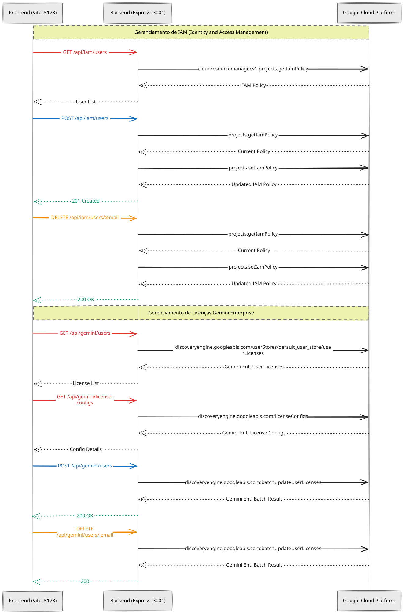

# EdGlobo GCP Admin

Painel web para gerenciar acessos no Google Cloud — quem pode usar o Agentspace e quem tem licença Gemini Enterprise — sem precisar abrir o console do GCP.

---

## Quick Start

```bash
# 1. Instale as dependências
npm run install:all

# 2. Configure as credenciais
cp backend/.env.example backend/.env
# Coloque o arquivo JSON da service account em backend/credentials.json
# Edite backend/.env se necessário

# 3. Rode tudo
npm run dev
```

Abra `http://localhost:5173` no navegador.

---

## Pré-requisitos

### Service Account no GCP

Crie uma service account no projeto `agentspace-469418` com as seguintes roles:

| Role | Para quê |
|------|----------|
| `roles/discoveryengine.agentspaceAdmin` | Gerenciar licenças Gemini Enterprise |
| `roles/iam.securityAdmin` | Gerenciar a role `discoveryengine.user` no IAM |

Baixe a chave JSON e salve em `backend/credentials.json`.

> **Por que duas roles separadas?** IAM policy do projeto (`setIamPolicy`) e a Discovery Engine API são sistemas distintos no GCP — cada um exige sua própria permissão.

### Variáveis de ambiente (`backend/.env`)

```env
GCP_PROJECT_ID=agentspace-469418
GOOGLE_APPLICATION_CREDENTIALS=./credentials.json
PORT=3001
```

---

## O que a aplicação faz

### Tela IAM — Discovery Engine User

Lista todos os usuários que têm a role `roles/discoveryengine.user` no projeto. É essa role que dá acesso de uso ao Agentspace.

Os membros ficam armazenados no formato de workforce pool:
```
principal://iam.googleapis.com/locations/global/workforcePools/entra-workforce/subject/usuario@edglobo.com.br
```
A interface exibe apenas o email (a última parte após `/`).

**Adicionar usuário:** basta digitar o email — o prefixo do workforce pool é preenchido automaticamente.

**Validação:** antes de adicionar, o backend verifica se o usuário já tem a role. Se tiver, retorna erro `409` com mensagem clara.

### Tela Gemini Enterprise — Licenças

Exibe as subscriptions ativas (total vs. atribuído por tier) e a lista completa de usuários com suas licenças.

**Adicionar usuário:** escolha o email e a licença no dropdown — o dropdown carrega os `licenseConfigs` disponíveis em tempo real, com o número de slots restantes visível antes de confirmar.

**Remover:** desatribui a licença, liberando o slot para outro usuário.

Ambas as telas fazem polling a cada **30 segundos** e têm botão de refresh manual.

---

## Arquitetura



O frontend nunca fala diretamente com o GCP — o backend autentica com a service account e atua como proxy seguro.

---

## API Reference

### IAM

```
GET    /api/iam/users              Lista usuários com roles/discoveryengine.user
POST   /api/iam/users              Adiciona usuário à role
DELETE /api/iam/users/:email       Remove usuário da role
```

**POST /api/iam/users — body:**
```json
{ "email": "usuario@edglobo.com.br" }
```

**GET /api/iam/users — response:**
```json
[
  {
    "email": "usuario@edglobo.com.br",
    "principal": "principal://iam.googleapis.com/locations/global/workforcePools/entra-workforce/subject/usuario@edglobo.com.br"
  }
]
```

### Gemini Enterprise

```
GET    /api/gemini/license-configs   Lista licenças disponíveis (com slots restantes)
GET    /api/gemini/users             Lista usuários com licença atribuída
POST   /api/gemini/users             Atribui licença a um usuário
DELETE /api/gemini/users/:email      Remove licença de um usuário
```

**POST /api/gemini/users — body:**
```json
{
  "email": "usuario@edglobo.com.br",
  "licenseConfig": "projects/agentspace-469418/locations/global/licenseConfigs/CONFIG_ID"
}
```

---

## Troubleshooting

### `PERMISSION_DENIED` ao chamar a API

```
Error: 7 PERMISSION_DENIED: Permission 'discoveryengine.userStores.listUserLicenses' denied
```

**Causa:** A service account não tem a role `roles/discoveryengine.agentspaceAdmin`.

**Solução:**
```bash
gcloud projects add-iam-policy-binding agentspace-469418 \
  --member="serviceAccount:SEU_SA@agentspace-469418.iam.gserviceaccount.com" \
  --role="roles/discoveryengine.agentspaceAdmin"
```

---

### `setIamPolicy` retorna 403

```
Error: 403 The caller does not have permission
```

**Causa:** A service account não tem permissão para modificar a IAM policy do projeto.

**Solução:** Adicione `roles/iam.securityAdmin` (ou `roles/resourcemanager.projectIamAdmin`) à service account.

---

### Backend retorna erro `ENOENT` na chave JSON

```
Error: ENOENT: no such file or directory, open './credentials.json'
```

**Causa:** O arquivo `backend/credentials.json` não existe ou o caminho em `GOOGLE_APPLICATION_CREDENTIALS` está errado.

**Solução:** Verifique se o arquivo existe em `backend/credentials.json` e que o `.env` aponta para ele corretamente.

---

### Dropdown de licenças aparece vazio

**Causa:** A service account pode não ter acesso à rota `/licenseConfigs`, ou o location configurado está errado.

**Verifique:**
```bash
curl -H "Authorization: Bearer $(gcloud auth print-access-token)" \
  "https://discoveryengine.googleapis.com/v1/projects/agentspace-469418/locations/global/licenseConfigs"
```

---

### Usuário adicionado no IAM não aparece na lista

**Causa:** O email precisa ser um subject válido no workforce pool `entra-workforce`. O GCP não valida a existência do subject no momento do `setIamPolicy` — a entry é criada mesmo com email inválido, mas o usuário não consegue autenticar.

**Verificação:** Confirme que o email pertence ao Entra ID federado no workforce pool.

---

## Estrutura de arquivos

```
ed-globo/
├── backend/
│   ├── src/
│   │   ├── index.js                  Express server
│   │   ├── routes/
│   │   │   ├── iam.js                Endpoints GET/POST/DELETE /api/iam
│   │   │   └── gemini.js             Endpoints GET/POST/DELETE /api/gemini
│   │   └── services/
│   │       ├── gcpAuth.js            GoogleAuth (service account)
│   │       ├── iamService.js         getIamPolicy / setIamPolicy
│   │       └── geminiService.js      Discovery Engine API
│   └── .env.example
└── frontend/
    └── src/
        ├── App.jsx                   Layout sidebar (Ant Design)
        ├── pages/
        │   ├── IAMPage.jsx           Tela IAM com polling + CRUD
        │   └── GeminiPage.jsx        Tela Gemini com subscriptions + CRUD
        └── api/
            ├── iam.js                Cliente axios para /api/iam
            └── gemini.js             Cliente axios para /api/gemini
```
